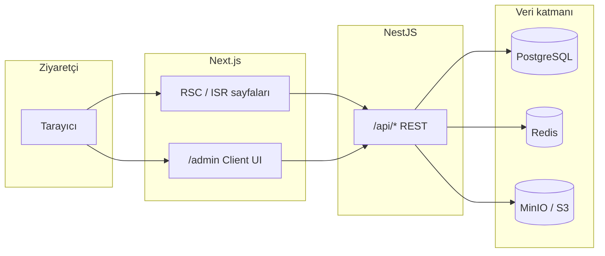

# Krontech Site — Proje sunumu için detaylı analiz

Bu doküman **Krontech / Kron Site** kod tabanının tamamına yönelik özet bir referanstır: mimari, özellikler, veri modeli, güvenlik, sunumda anlatılabilecek **neyi tamamladık** ve özellikle **neden bu yolu seçtik** (tasarım kararlarının gerekçesi).

Resmi operasyon rehberi için kökteki **`PROJECT_GUIDE.md`** ve adım notları **`files/progress/ADIM_*.md`** kullanılmalıdır.

---

## 1. Tek cümle ile proje ne?

**Kurumsal bir ürün/yazılım şirketi için çift dilli (EN/TR) pazarlama sitesi + tam özellikli içerik yönetimi:** ziyaretçi tarafında ürünler, çözümler, blog, kaynaklar, iletişim/demo formları ve SEO; yönetici tarafında JWT ile korunan admin panelinden tüm içeriğin CRUD’u, medya kütüphanesi ve kullanıcı yönetimi.

---

## 2. Teknoloji yığını (stack)

| Katman | Teknoloji |
|--------|-----------|
| **Önyüz** | Next.js 14 (App Router), React, TypeScript, Tailwind CSS |
| **API** | NestJS 10, TypeScript |
| **ORM / DB** | Prisma + PostgreSQL 16 |
| **Önbellek** | Redis 7 |
| **Dosya/medya** | S3 uyumlu API — geliştirmede MinIO |
| **Kimlik doğrulama** | JWT (access ~15 dk + refresh ~7 gün), rol tabanlı yetkilendirme |
| **Bot/spam** | Google reCAPTCHA v3 (isteğe bağlı anahtarlarla) |
| **Dağıtım (lokal)** | Docker Compose (postgres, redis, minio, backend, frontend) |
| **Test** | Jest (backend unit + e2e Supertest), Jest + Testing Library (frontend) |

---

## 3. Depo yapısı (yüksek seviye)

```
Kron Site/
├── frontend/          # Next.js uygulaması (public + /admin)
├── backend/           # NestJS REST API + Prisma
├── docker-compose.yml # Tüm servislerin tanımı
├── .env.example       # Kök ortam şablonu (Compose senaryosu)
├── PROJECT_GUIDE.md   # Kurulum, smoke test, sık sorunlar
├── files/
│   ├── PLAN.md, ODEV.md
│   ├── progress/ADIM_*.md   # Her fazın yapıldı kanıtı / kararları
│   └── PROJECT_SUNUM_ANALIZI.md   # ← bu dosya
├── backend/.env.example       # Backend için şablon (anahtarlar placeholder)
└── frontend/.env.example      # Frontend için şablon
```

---

## 4. Mimari akış



- **Public sayfalar:** Çoğu içerik sunucuda `fetch`/`sfetch` ile API’den gelir; Next.js tarafında tag/revalidate ile ISR benzeri davranış.
- **Admin:** Tarayıcıdan axios tabanlı client, JWT **httpOnly cookie** ile korunan route grubu.

---

## 5. Docker Compose ile çalışan servisler

| Servis | Amaç | Tipik host portları |
|--------|------|---------------------|
| **postgres** | Ana veritabanı | 5433→5432 |
| **redis** | Cache / oturum önbelleği | 6380→6379 |
| **minio** | S3 uyumlu nesne depolama (+ konsol 9001) | 9000, 9001 |
| **backend** | Nest API | 4000 |
| **frontend** | Next.js | 3000 |

Detaylı komutlar ve seed adımları: **`PROJECT_GUIDE.md`** §3–§5.

---

## 6. Veritabanı modelleri (Prisma özeti)

| Model | Rol |
|-------|-----|
| **User** | Admin kullanıcıları (email, şifre hash, rol: admin/editor) |
| **Product** + **ProductTranslation** | Ürün/çözüm içeriği (kind: product \| solution), çok dillilik |
| **ProductCategory** + çeviriler | Ürün kategorileri |
| **BlogPost** + **BlogPostTranslation** | Blog / haber, görüntülenme sayısı |
| **Resource** | Datasheet / case study / whitepaper vb., locale bazlı |
| **Office** | Ofis lokasyonları (iletişim sayfası & footer listesi) |
| **AnnouncementBar** | Üst duyuru şeridi metni (admin’den yönetilir; SiteShell’de şeridin gösterimi projede kapalı olabilir — kod duruyor) |
| **Media** | Medya kütüphanesi meta + S3 anahtarı |
| **FormSubmission** | Contact / demo form gönderileri (JSON payload) |
| **Redirect** | Path bazlı yönlendirme kuralları |
| **Testimonial** | Ürün referansları |
| **AuditLog** / **ContentVersion** | Denetim ve içerik versiyon izi |

---

## 7. Backend (NestJS) modüller ve sorumluluklar

| Modül | Özet |
|-------|------|
| **auth** | Kayıt/giriş yok (seed ile admin); JWT üretimi, refresh, cookie stratejisi |
| **users** | Admin kullanıcı CRUD (admin-only silme vb.) |
| **products** | Public liste/detay + admin CRUD; yayın zamanlaması; **ürün vs çözüm** (`kind`); Redis cache; Next **revalidation** tetikleri |
| **blog** | CRUD, yayın akışı, view count, revalidation |
| **resources** | Liste/indirme, admin CRUD, revalidation |
| **media** | Presigned upload URL’leri, public URL çözümü, alt text |
| **forms** | `POST /forms/contact`, `POST /forms/demo`; rate limit; **RecaptchaService** ile Google doğrulama |
| **offices** | Public liste (locale); admin CRUD; cache invalidation + **ISR revalidation** (contact/footer tag’leri) |
| **announcement-bar** | Public tek aktif duyuru; admin CRUD |
| **redirects** | Admin + middleware ile uyumlu path kuralları |
| **sitemap** | XML üretimi veya besleme (SEO ile birlikte) |

### Ortak servisler (`src/common`)

- **cache:** Redis ile namespace bazlı invalidation  
- **audit:** Önemli işlemlerin loglanması  
- **s3:** MinIO/AWS uyumlu yükleme  
- **recaptcha:** `siteverify` ile Google’a POST  
- **revalidation:** Next.js `POST /api/revalidate` (secret + tag/path)  
- **scheduler:** Planlı yayına geçiş + toplu revalidation tetikleri  

---

## 8. Frontend — genel site (public)

### Dil ve routing

- **`app/(site)/`** → İngilizce (`/` önekli)
- **`app/tr/`** → Türkçe (`/tr` önekli)
- Çeviri metinleri **`lib/i18n.ts`** dictionary’sinde (CMS’den çeviri UI’sı yok — bilinçli kapsam dışı).

### Önemli sayfa grupları

| Alan | Route örnekleri | Not |
|------|-----------------|-----|
| Ana sayfa | `/`, `/tr` | Hero, özellik blokları |
| Ürünler | `/products`, `/tr/products` | API `kind=product` |
| Çözümler | `/solutions`, `/tr/solutions` | API `kind=solution` |
| Ürün detay | `/products/[slug]` | JSON-LD, çeviri |
| Blog | `/blog`, `/blog/[slug]`; `/tr/...` | Haber/blog tip ayrımı |
| Kaynaklar | `/resources`, `/resources/[id]` | İndirilebilir içerik |
| İletişim | `/contact` | Ofisler API’den; ContactForm |
| Demo | `/demo` | DemoForm |
| SEO proxy | `/sitemap.xml`, `/robots.txt` | Backend veya Next katmanlı |

### Layout

- **`SiteShell`:** Navbar + main + Footer (şu anlık yapılandırmada üst **announcement bar SiteShell içinden render edilmiyor** olabilir; bileşenler duruyor.)
- **`Navbar`:** Sabit header; scroll ile tema değişimi; locale switcher.
- **`Footer`:** Dinamik ofis listesi (`/api/offices?locale=`).

### Formlar

- **React Hook Form + Zod**
- **reCAPTCHA v3:** `react-google-recaptcha-v3` (`GoogleReCaptchaProvider` + `executeRecaptcha`); anahtar yoksa provider devre dışı, backend uyarıyla doğrulamayı atlayabilir.

---

## 9. Frontend — Admin panel (`/admin`)

### Erişim

- **`/admin/login`** → JWT cookie
- **`app/admin/(protected)/`** → Oturum gerektiren sayfalar

### Rol davranışı

- **admin:** Tüm modüller + kullanıcı yönetimi + bazı silme işlemleri  
- **editor:** İçerik modülleri; kullanıcı listesi tipik olarak **gizli**

### Modül listesi (menü ile uyumlu)

| Modül | İşlev |
|-------|--------|
| Dashboard | İstatistik kartları (ürün/blog/kaynak/medya/form sayıları) |
| Ürünler & Çözümler | Liste; oluştur/düzenle; **kind** (Ürün/Çözüm); yayın durumu |
| Blog | Liste + TipTap editör ile yazı yönetimi |
| Kaynaklar | Tür + locale + sıra |
| Medya kütüphanesi | Yükleme grid’i, alt metin |
| Form gönderileri | İletişim/demo kayıtları, detay |
| Redirects | Kaynak/hedef path, HTTP kodu |
| Duyuru barı | Metin, link, zaman penceresi |
| Ofisler | Şehir, iletişim, sıra |
| Kullanıcılar | Admin-only hesap yönetimi |

Paylaşılan UI: **DataTable**, **FormCard**, **StatusBadge**, **MediaPicker**, pagination vb.

---

## 10. Güvenlik ve uyumluluk

| Konu | Uygulama |
|------|-----------|
| API kimliği | JWT (access + refresh), httpOnly cookie önerilen akış |
| Yetkilendirme | NestJS guards (JWT + RolesGuard) |
| Hız limiti | Örn. form endpoint’leri IP başına dakikalık throttle |
| Spam | Honeypot alanı + reCAPTCHA v3 + backend doğrulama |
| Şifreler | bcrypt (veya eşdeğer) ile hash |
| CORS | `.env` ile frontend origin |

---

## 11. Performans ve içerik güncelliği

- **Redis:** Ürün/ofis/blog vb. için cache anahtarları  
- **Next.js revalidation:** İçerik değişince backend `RevalidationService` ile frontend `tags`/`paths` invalidasyonu  
- **Planlı yayın:** Scheduler ile “scheduled → published” geçişi + revalidation  

---

## 12. Test durumu (rakamlar PROJECT_GUIDE ile uyumlu)

| Tür | Yaklaşık |
|-----|-----------|
| Backend unit | ~167 test |
| Backend e2e | Postgres açıkken Supertest paketleri |
| Frontend Jest | 160+ test |

Komut örnekleri: **`PROJECT_GUIDE.md`** §7.

---

## 13. Bilinçli olarak yapılmayan / roadmap (sunumda dürüst olun)

**PROJECT_GUIDE.md §8** ile uyumlu özet:

- Üretim deploy (HTTPS, CI/CD, reverse proxy tam şablonu)
- Yedekleme otomasyonu, merkezi gözlem (Sentry vb.)
- Form gönderince otomatik e-posta bildirimi
- Playwright/Cypress tam tarayıcı E2E
- Admin üzerinden i18n metin düzenleme

---

## 14. Son mimari/UI iyileştirmeleri (konuşma geçmişinden — özellik tanımı)

Sunumda “ürün olgunluğu” olarak anlatılabilecek ekler:

- Ürünlerde **`kind`** (Ürün / Çözüm): API, admin formu, liste kolonları, sayfa başlıkları ve public `/products` vs `/solutions` ayrımı  
- Admin listede **`text-kron-gray`** token’ının arka plan rengi (#f8fafc) ile çakışması nedeniyle tablo okunabilirliği **`text-gray-700`** ile düzeltildi  
- Dashboard kart başlıkları görünür renklere çekildi  
- Docker frontend build için katı TypeScript (`kind` select vb.)  
- **Offis** CRUD sonrası Next ISR için **revalidation** (`offices` tag + `/contact` path’leri)  
- **`backend/.env.example`** şablonu eklendi  
- **İletişim sayfası** ofisleri **`GET /api/offices?locale=`** ile çeker  

*(Announcement bar’ın SiteShell üzerinden gösterilip gösterilmediği güncel branch’de kapalı olabilir — kod tabanında bileşen ve backend modülü duruyor.)*

---

## 15. Neden böyle yaptık? (Kararların gerekçesi)

Sunumda sık sorulan “**niçin böyle?**” sorularına doğrudan yanıt olacak şekilde özetlendi.

### 15.1 İki ayrı uygulama: Next.js + NestJS

| Neden | Açıklama |
|-------|----------|
| **Sorumluluk ayrımı** | Pazarlama yüzü (SEO, hız, RSC) ile iş kuralları, yetki, DB ve entegrasyonların ayrı kod tabanlarında tutulması bakım ve ekip ölçeklemesini kolaylaştırır. |
| **Güvenlik** | Veritabanı ve gizli anahtarlar yalnızca sunucu tarafında; tarayıcı bundle’ına sızmaz. |
| **Esneklik** | İleride mobil uygulama veya başka bir CMS aynı API’yi kullanabilir (“headless” vitrin). |

### 15.2 Docker Compose ile tüm ortamın kalkması

| Neden | Açıklama |
|-------|----------|
| **Tek komut onboarding** | Yeni geliştirici veya hakem için “aynı sürüm PostgreSQL ve Redis var mı?” tartışması biter. |
| **Üretime yakın** | Servislerin birbirleriyle ağ içinde konuşması prod mantığıdır; port ve healthcheck’ler buna göre. |
| **MinIO dahil olması** | S3’yi herkesin AWS hesabı olmadan lokal doğrulanabilmesi için; kod S3 uyumlu API ile yazılmış. |

### 15.3 PostgreSQL + Prisma

| Neden | Açıklama |
|-------|----------|
| **İlişkisel içerik** | Ürün–çeviri, kategori–çeviri, blog–çeviri gibi yapılar SQL ile doğal. |
| **Prisma** | Şema tek kaynak; migration + tip güvenliği ile backend ve DB dalgalanması azaltılır. |

### 15.4 Redis

| Neden | Açıklama |
|-------|----------|
| **Okuma maliyeti** | Ürün listesi gibi endpoint’ler her istekte DB’yi dövmesin diye önbellek. |
| **Invalidation mimarisi** | İçerik güncellenince namespace temizlenir; tutarlılık “TTL’e güvenmeden” yönetilebilir. |

### 15.5 JWT ve roller (admin / editor)

| Neden | Açıklama |
|-------|----------|
| **Stateless kimlik doğrulama** | Ölçekte sunucunun her istek için oturumu DB’den okumasını zorunlu kılmaz (refresh stratejisi ile dengelenir). |
| **Roller** | Kullanıcı silme vs. içerik düzenleme ayrımı yanlışlıkla kritik aksiyonu engeller; gerçek ekipte günlük gereksinim. |

### 15.6 Formlar: rate limit + honeypot + reCAPTCHA v3

| Neden | Açıklama |
|-------|----------|
| **Throttle** | Açık bir endpoint brute-force spam ile hem DB’yi hem desteği felç etmesin diye IP bazlı limitleme. |
| **Honeypot** | Basit botlar için sıfır maliyetli ek koruma (kullanıcı görmez). |
| **reCAPTCHA v3** | Checkbox ile UX kırmadan skor bazlı doğrulama; anahtar yoksa doğrulama **bilinçli olarak** gevşek bırakılabiliyor ki lokal geliştirici takılmasın. |

### 15.7 Next.js tarafında ISR / tag + backend’den revalidation

| Neden | Açıklama |
|-------|----------|
| **Statik yakın davranış, dinamik içerik** | Sayfa başına SSR her seferinde pahalı olabilir; tag invalidate ile yayın güncelliği korunur. |
| **Yazma sonrası tetik** | Admin bir şey yayınladığında backend’in `POST .../api/revalidate` ile Next’in önbelleğini düşmesi bekleneni net yapar (“kayıt oluştu mu ama site eski mi?” yaşanmasın diye). |

### 15.8 İki dil: EN/TR (şimdilik kod içi dictionary)

| Neden | Açıklama |
|-------|----------|
| **Kapsam kontrolü** | Tam çeviri CMS’i büyük üründür; bu projede içerik metinleri API’den, sabit UI sözlüğü ise `lib/i18n` üzerinden yönetilerek zaman ve karmaşıklık sınırları çizildi. |
| **`/tr` + route grupları** | Yerelleştirilmiş URL yapısı ve SEO dil alternatifleri ile uyumludur. |

### 15.9 Üründe `kind`: “Ürün” vs “Çözüm”

| Neden | Açıklama |
|-------|----------|
| **İş kullanıcı dilinde ayrım** | Aynı “ürün kartı” altyapısı ile pazarlama hem ürün kataloğunu hem çözüm sayfalarını yönetmek istiyorsa tek veri modeli yerine **aynı tabloda tür bayrağı** tutmak DRY kalır ve listeler `?kind=` ile ayrılır. |
| **Admin deneyimi** | Form başlığı ve liste “Ürünler & Çözümler” ile editörün kafasında model netleşir. |

### 15.10 Admin tablo metinleri: `text-gray-700` düzeltmeleri

| Neden | Açıklama |
|-------|----------|
| **Tema hatasının kök nedeni** | Tailwind paletinde **`kron.gray`** açık arka plan rengine (#f8fafc) yakın tanımlandığı için **`text-kron-gray`** beyaz zeminde neredeyse görünmez hale geliyordu. |
| **Karar** | Veri kolonlarında okunabilirlik için nötr **`text-gray-700`** kullanmak yanlış token’ı “çalışan gri” ile değiştirmekten daha hızlı ve tutarlıydı (ileride tasarım tokenı `kron.gray` için `text` rolü yeniden tanımlanabilir). |

### 15.11 Dashboard kartlarında görünür başlıklar

| Neden | Açıklama |
|-------|----------|
| Aynı **`text-kron-gray`** kullanımı kart üst yazılarında da okunamazlığa gidiyordu; sayıları gösterip başlığı gizliyordu. **Ürün dili güncellenerek** kartın neyi saydığı anlatılır oldu. |

### 15.12 Ofis listesi için API + iletişim sonrası revalidation

| Neden | Açıklama |
|-------|----------|
| **Tek kaynak** | Ofisler hem footer hem contact’ta aynı veriyi çekmeli ki çelişki olmasın. |
| **Yazma sonrası güncelleme** | SSR/ISR ile cache’lenmiş sayfalarda yeni ofisin hemen çıkmaması kullanıcıyı yanlış yönlendirir; bu yüzden create/update/delete sonrası **`offices` tag’ı** ve **contact path’leri** revalidate edilir. |
| **`revalidate` süresinin düşürülmesi** (contact fetch) | Sadece revalidation’a güvenmek bazen daha uzun pencerede eski görüntü bırakır; iletişim sayfasında daha kısa yenileme penceresi kabul edilebilir UX bedeli olarak seçilebilirdi. |

### 15.13 Duyuru çubuğu — localStorage dismiss + Navbar offset

| Neden | Açıklama |
|-------|----------|
| **Kalıcı kapatma** | Kullanıcı X’e bastığında sayfa yenilense bile aynı duyuru tekrarından kaçınılır (**duyuru id** bazlı anahtar). |
| **Navbar offset** | Üstte sabit banner varken `fixed` header’ın `top` değeri artırılır ki içerik altına sıkışmasın; kapandığında sıfırlanmalı (event ile). Bazı dallarda banner SiteShell’dan tamamen kapatılmış olabilir: **kampanya yok/geçiş dönemi** veya tasarım kararı; kod gelecekte yeniden açılmaya uygun kalır. |

### 15.14 `backend/.env.example`

| Neden | Açıklama |
|-------|----------|
| Yeni katılan veya hakem **`backend/.env` içeriğini bilmeden** hangi anahtarların gerektiğini görsün; gerçek secret’lar repo dışında kalsın. |

### 15.15 TypeScript sıkılığı ve Docker build

| Neden | Açıklama |
|-------|----------|
| Lokal gevşek ayarların ürettiği kod, **Docker içindeki `npm run build`** sırasında patlayınca deploy riski oluşuyordu. Form alanlarında `string` → birleşik tip (`product` \| `solution`) gibi daraltmalar bu sınıf sorunları giderir. |

---

## 16. Sunum için önerilen anlatım sırası (15 dk örnek)

1. **Problem:** Statik kurumsal site yetmez; içeriği ekip güncellemeli, iki dilde olmalı.  
2. **Çözüm:** Headless yaklaşım — Next.js vitrin + NestJS API + Postgres.  
3. **Demo akışı:** Ana sayfa → ürün listesi/detay → admin giriş → bir içeriği düzenle → sitede güncellenmiş görünüm (veya revalidation).  
4. **Güvenlik:** JWT rolleri + form throttle + reCAPTCHA.  
5. **Operasyon:** `docker compose up`, seed, `.env.example`.  
6. **Sonraki adım:** Üretim deploy + gözlem + e-posta bildirimi.

---

## 17. Hızlı komut hatırlatıcısı

```bash
cp .env.example .env    # kök
docker compose up --build
docker compose exec backend npm run prisma:seed   # ilk kurulum
```

- Site: **http://localhost:3000**  
- API: **http://localhost:4000/api**  
- Admin: **http://localhost:3000/admin**  

---

*Bu dosya sunum hazırlığı içindir; teknik doğruluk için her zaman güncel kod ve `PROJECT_GUIDE.md` referans alınmalıdır.*
